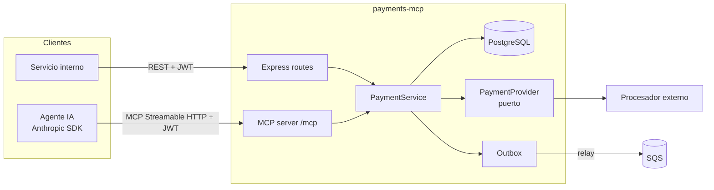
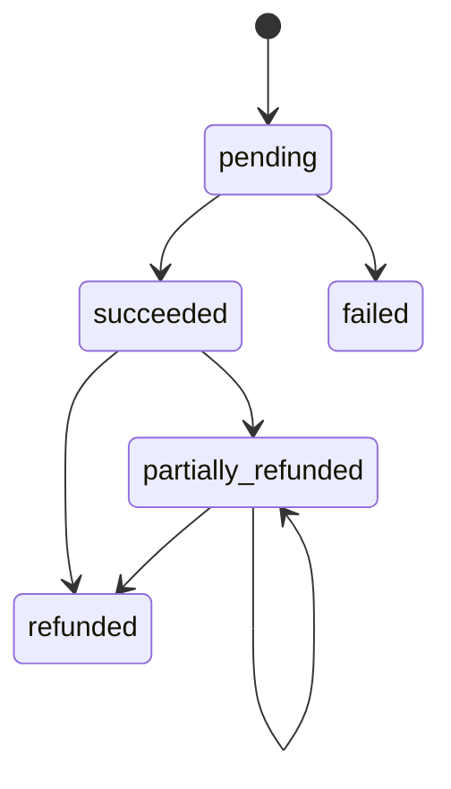

# Diseño — Pagos

## Visión general



**Decisión clave:** REST y MCP son dos *adaptadores de entrada* sobre el mismo `PaymentService`.
Las reglas de negocio viven en un solo lugar (arquitectura hexagonal / puertos y adaptadores).

## Modelo de datos

```sql
CREATE TABLE payments (
  id              UUID PRIMARY KEY,
  merchant_id     TEXT        NOT NULL,
  amount_minor    BIGINT      NOT NULL CHECK (amount_minor > 0),
  currency        CHAR(3)     NOT NULL,
  status          TEXT        NOT NULL,           -- pending|succeeded|failed|partially_refunded|refunded
  refunded_minor  BIGINT      NOT NULL DEFAULT 0 CHECK (refunded_minor <= amount_minor),
  description     TEXT,
  provider_ref    TEXT,
  failure_reason  TEXT,
  created_at      TIMESTAMPTZ NOT NULL,   -- la app lo asigna (precisión de ms, ver cursor)
  updated_at      TIMESTAMPTZ NOT NULL
);
-- Soporta el listado por comercio (+ filtro opcional de estado) con keyset pagination.
-- Un btree se recorre hacia atrás, así que ASC también sirve ORDER BY created_at DESC, id DESC.
CREATE INDEX payments_merchant_created_idx ON payments (merchant_id, created_at, id);
CREATE INDEX payments_merchant_status_created_idx ON payments (merchant_id, status, created_at, id);

CREATE TABLE refunds (
  id            UUID PRIMARY KEY,
  payment_id    UUID NOT NULL REFERENCES payments(id),
  amount_minor  BIGINT NOT NULL CHECK (amount_minor > 0),
  created_at    TIMESTAMPTZ NOT NULL DEFAULT now()
);

CREATE TABLE idempotency_keys (
  merchant_id     TEXT  NOT NULL,
  key             TEXT  NOT NULL,
  fingerprint     TEXT  NOT NULL,     -- sha256(operación + entrada canónica)
  response_body   JSONB,              -- NULL mientras la operación está en curso
  created_at      TIMESTAMPTZ NOT NULL DEFAULT now(),
  PRIMARY KEY (merchant_id, key)
);

CREATE TABLE outbox (
  id           BIGSERIAL PRIMARY KEY,
  topic        TEXT  NOT NULL,
  payload      JSONB NOT NULL,
  created_at   TIMESTAMPTZ NOT NULL DEFAULT now(),  -- para medir el retraso del relay
  published_at TIMESTAMPTZ
);
CREATE INDEX outbox_unpublished_idx ON outbox (id) WHERE published_at IS NULL;
```

### Por qué estos índices

- `(merchant_id, created_at, id)` coincide con `WHERE merchant_id = $1 ORDER BY created_at
  DESC, id DESC LIMIT n`, por lo que Postgres hace un *index scan* sin `Sort`.
- La paginación por **cursor** (`WHERE (created_at, id) < ($2, $3)`) es O(log n) por página;
  `OFFSET` es O(n) y se degrada en páginas profundas.
- Índice **parcial** en `outbox` para que el relay lea solo los pendientes.
- `created_at` lo asigna la aplicación: JS tiene precisión de milisegundos y Postgres de
  microsegundos. Si lo pusiera `now()`, el cursor perdería precisión y la paginación podría
  saltarse o repetir filas.
- La query del listado se arma dinámicamente en vez de `($2 IS NULL OR status = $2)`, para que
  cada forma tenga su propio plan y use el índice adecuado.

## Máquina de estados



## Idempotencia

1. Se calcula `fingerprint` = sha256 de la operación + la entrada con claves ordenadas.
   Se guarda el *resultado del servicio* (vista JSON), no la respuesta HTTP: así REST y MCP
   comparten la misma idempotencia.
2. `INSERT … ON CONFLICT DO NOTHING` en `idempotency_keys` (la PK es la "cerradura").
3. Si ya existía: si el hash coincide y hay `response_body`, se devuelve esa respuesta. Si el hash
   coincide y aún no hay respuesta (petición en curso), se devuelve `409 REQUEST_IN_PROGRESS`.
   Si el hash difiere, se devuelve `422`.
4. Si es nueva: se ejecuta la operación y se guarda la respuesta. Si la operación lanza un
   error, la clave se **libera** para que el cliente pueda reintentar.

**Limitaciones conocidas:** si el proceso muere entre `begin` y `complete`, la clave queda
"en curso" para siempre (solución: expirar claves en curso tras N minutos). Si el reembolso del
proveedor hace timeout dentro de la transacción, se hace rollback aunque el proveedor pudo haberlo
ejecutado (solución: estado `refund_pending` + conciliación).

**Evolución (Fase 4):** mover `idempotency_keys` a DynamoDB con PK `MERCHANT#<id>`, SK `KEY#<key>`,
`PutItem` con `ConditionExpression attribute_not_exists(pk)` y **TTL** de 24 h. Ventaja: las claves
expiran solas y no cargan la BD transaccional.

## Autenticación

- `POST /oauth/token` (client credentials). Los clientes se configuran con `client_id`, el
  hash del secreto, `merchant_id` y los scopes permitidos.
- El JWT se firma con **ES256**; la clave pública se publica en `/.well-known/jwks.json`, de modo
  que otros servicios validan sin compartir secretos.
- Middleware `requireScope('payments:write')` por ruta.
- **mTLS** (Fase 6): entre servicios internos, terminado en el ingress/service mesh de EKS. El JWT
  identifica *quién* llama; mTLS garantiza *desde dónde*.

## Diseño MCP

### Autorización según la especificación MCP (2025-11-25)

1. `POST /mcp` sin token válido → `401` con
   `WWW-Authenticate: Bearer resource_metadata=".../.well-known/oauth-protected-resource/mcp"`.
2. Protected Resource Metadata (RFC 9728) → `resource` y `authorization_servers`.
3. Authorization Server Metadata (RFC 8414) → `token_endpoint`, `grant_types_supported: [client_credentials]`.
4. `POST /oauth/token` con `resource=<url>/mcp` (RFC 8707) → JWT con `aud = <url>/mcp`.

- **Un token, un recurso:** el REST valida `aud = payments-api` y el MCP `aud = <url>/mcp`. Un token
  de un lado no sirve en el otro (evita *token passthrough* y *confused deputy*).
- **Scopes:** se concede la intersección entre lo pedido y lo permitido (RFC 6749 §3.3); solo es
  error si no queda nada. Los clientes MCP genéricos piden todo lo que anuncia `scopes_supported`.
- **Tools por scope:** cada tool se registra solo si el token tiene su scope.
- `authorization_endpoint` existe solo por compatibilidad con el SDK y responde
  `unsupported_response_type`.

| Tool | Scope | Notas |
|---|---|---|
| `get_payment` | `payments:read` | `readOnlyHint: true` |
| `list_payments` | `payments:read` | `readOnlyHint: true` |
| `create_payment` | `payments:write` | Requiere `idempotencyKey` en la entrada |
| `refund_payment` | `payments:refund` | `destructiveHint: true`; sin `confirm: true` solo devuelve una vista previa |

- El transporte Streamable HTTP valida el Bearer token **antes** de crear la sesión MCP.
- Por cada petición se construye un servidor MCP con el contexto de auth (`merchantId`, scopes),
  de modo que el modelo **nunca** elige el `merchantId`: sale del token. Esto evita que un
  *prompt injection* acceda a pagos de otro comercio.
- Los errores de dominio se mapean a `{ isError: true, content: [{ type: 'text', text }] }`.

## Integración con el procesador

`PaymentProvider.charge({ amountMinor, currency, reference }) → { status, providerRef, failureReason? }`.
Implementaciones: `FakeProvider` (determinista para tests: un monto terminado en `13` se rechaza y
uno terminado en `99` produce timeout) y, en el futuro, un adaptador HTTP real con timeout de 5 s y
reintentos con *backoff* solo para errores idempotentes.

## Eventos (outbox + SQS)

**Problema:** guardar el pago y publicar en SQS son dos sistemas distintos. Si se publica dentro del
request y SQS falla, ¿se revierte el pago? (Requisito 6.2 dice que no). Si se publica después del
`COMMIT` y el proceso muere en medio, el evento se pierde.

**Solución — outbox transaccional:**

1. Cada cambio de estado escribe una fila en `outbox` **con el mismo cliente/transacción** que el
   `INSERT`/`UPDATE` del pago (`repo.appendEvent`). O se guardan los dos o ninguno.
   - `create`: transacción 1 = pago `pending` + `payment.pending`; transacción 2 = resultado del
     procesador + `payment.succeeded`/`payment.failed`. Si hubo timeout, solo existe el primero.
   - `refund`: dentro de la transacción con `FOR UPDATE` → `payment.partially_refunded`/`payment.refunded`.
   - Un *replay* idempotente no escribe eventos (devuelve la respuesta guardada).
2. `OutboxRelay` (en cada pod) hace *polling* cada `OUTBOX_POLL_MS`:
   `SELECT … WHERE published_at IS NULL ORDER BY id LIMIT 10 FOR UPDATE SKIP LOCKED` →
   `SendMessageBatch` → `UPDATE … SET published_at = now()` solo para los ids que SQS aceptó.
   - `SKIP LOCKED`: varios relays se reparten las filas en vez de esperarse.
   - Lote máximo 10 (límite de SQS). Lote lleno y exitoso → siguiente pasada inmediata (backlog).
   - Fallo parcial (`Failed` en la respuesta) o SQS caído → las filas quedan pendientes y se
     reintentan; un SQS caído espera el intervalo para no martillarlo.

**Garantías:**

- **At-least-once:** si SQS aceptó el lote pero el `COMMIT` falla, se reenvía. Cada evento lleva un
  `eventId` (UUID) para que el consumidor deduplique.
- **Sin orden global:** SQS estándar y varios relays no garantizan orden. El consumidor usa
  `occurredAt`/`status` (o se migra a SQS FIFO con `MessageGroupId = paymentId` si hiciera falta).
- **Mensaje:** cuerpo JSON `{ eventId, type, paymentId, merchantId, status, requestId, occurredAt }`;
  atributo `topic` para filtrar. La cola tiene DLQ (`maxReceiveCount = 5`).

**Trade-off conocido:** el relay mantiene la transacción abierta mientras llama a SQS (timeout 5 s).
Alternativa si escala: marcar filas con un *lease* (`locked_until`) y publicar fuera de la transacción.
Limpieza de filas publicadas (job o particionado por fecha) queda pendiente.

Local: `npm run sqs:up` (LocalStack 4.4 fijado; las imágenes ≥ 2026.03 piden `LOCALSTACK_AUTH_TOKEN`)
y `npm run sqs:peek` para ver los mensajes.

## Observabilidad

| Señal | Implementación | Responde |
|---|---|---|
| Métricas | `prom-client` en `/metrics` (registro propio, `src/core/metrics.ts`) → Prometheus (pull, cada 5 s en local) | ¿Algo anda mal? |
| Logs | pino JSON a stdout → Alloy lee el stdout del contenedor → Loki | ¿Qué pasó exactamente? |
| Dashboards y alertas | Grafana con datasources y dashboard provisionados; reglas en `observability/prometheus/alerts.yml` | Todo junto |

**Métricas (Requisito 7.1):**

- `http_request_duration_seconds{method, route, status_code}` (histogram): su `_count` es el contador de
  requests, así que cubre las tres letras de RED. `route` es el **patrón** (`/api/v1/payments/:id`),
  nunca la URL; sin ruta → `<prefijo>/*` (p. ej. 401 antes del router) o `unmatched`.
  - Trampa de Express: si el handler lanza, Express restaura `req.baseUrl` antes del error handler. Por
    eso `rememberMountPath` guarda el prefijo en `res.locals` mientras la petición está dentro del router.
- `payments_total{status}`: transiciones de estado, contadas **después del COMMIT**.
- `mcp_tool_calls_total{tool, outcome}` con `outcome ∈ ok | domain_error | internal_error`.
- `outbox_pending_events` (gauge leído en cada scrape con el índice parcial), `outbox_events_published_total`,
  `outbox_relay_errors_total`.
- Métricas por defecto de Node (CPU, memoria, event loop lag, GC).

**Logs (7.2):** `level` como texto (`"warn"`), `requestId` en cada línea, `authorization`/`cookie`
redactados. En Loki solo `app` y `level` son *labels*; `requestId` se busca al consultar
(`{app="payments-mcp"} | json | requestId="…"`), porque como label tendría cardinalidad ilimitada.

**Alertas:** 5xx > 5 % por 5 min, p95 > 1 s por 10 min, outbox > 100 pendientes por 5 min.

`/metrics` no lleva auth: en EKS se expone en la red interna (NetworkPolicy o puerto aparte), no en el Ingress.

Local: `npm run obs:up` → app en `:3000`, Grafana en `:3001`, Prometheus en `:9090`.

## Manejo de errores

Formato único: `{ "error": { "code": "PAYMENT_NOT_FOUND", "message": "…", "requestId": "…" } }`.

## Estrategia de pruebas

- **Unit:** service con repositorio y provider *fake* (máquina de estados, idempotencia, límites de reembolso).
- **Integration:** Express + Postgres real (Docker) con `supertest`-like `fetch`; MCP con el
  `Client` oficial del SDK contra el servidor en memoria.
- Cobertura con `node --test --experimental-test-coverage`; el umbral del 85 % se aplica en CI.
