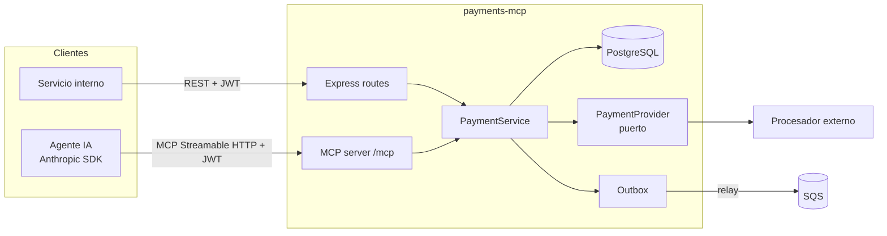
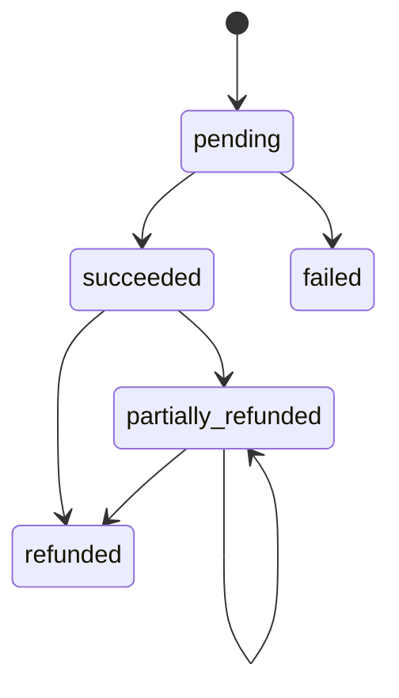

# Diseño — Pagos

## Visión general



**Decisión clave:** REST y MCP son dos *adaptadores de entrada* sobre el mismo `PaymentService`.
Las reglas de negocio viven en un solo lugar (arquitectura hexagonal / puertos y adaptadores).

## Modelo de datos

```sql
CREATE TABLE payments (
  id              UUID PRIMARY KEY,
  merchant_id     TEXT        NOT NULL,
  amount_minor    BIGINT      NOT NULL CHECK (amount_minor > 0),
  currency        CHAR(3)     NOT NULL,
  status          TEXT        NOT NULL,           -- pending|succeeded|failed|partially_refunded|refunded
  refunded_minor  BIGINT      NOT NULL DEFAULT 0 CHECK (refunded_minor <= amount_minor),
  description     TEXT,
  provider_ref    TEXT,
  failure_reason  TEXT,
  created_at      TIMESTAMPTZ NOT NULL DEFAULT now(),
  updated_at      TIMESTAMPTZ NOT NULL DEFAULT now()
);
-- Soporta el listado por comercio (+ filtro opcional de estado) con keyset pagination.
CREATE INDEX payments_merchant_created_idx ON payments (merchant_id, created_at DESC, id DESC);
CREATE INDEX payments_merchant_status_created_idx ON payments (merchant_id, status, created_at DESC, id DESC);

CREATE TABLE refunds (
  id            UUID PRIMARY KEY,
  payment_id    UUID NOT NULL REFERENCES payments(id),
  amount_minor  BIGINT NOT NULL CHECK (amount_minor > 0),
  created_at    TIMESTAMPTZ NOT NULL DEFAULT now()
);

CREATE TABLE idempotency_keys (
  merchant_id     TEXT  NOT NULL,
  key             TEXT  NOT NULL,
  request_hash    TEXT  NOT NULL,     -- sha256 del método + ruta + cuerpo
  response_status INT,
  response_body   JSONB,
  created_at      TIMESTAMPTZ NOT NULL DEFAULT now(),
  PRIMARY KEY (merchant_id, key)
);

CREATE TABLE outbox (
  id           BIGSERIAL PRIMARY KEY,
  topic        TEXT  NOT NULL,
  payload      JSONB NOT NULL,
  published_at TIMESTAMPTZ
);
CREATE INDEX outbox_unpublished_idx ON outbox (id) WHERE published_at IS NULL;
```

### Por qué estos índices

- `(merchant_id, created_at DESC, id DESC)` coincide con `WHERE merchant_id = $1 ORDER BY created_at
  DESC, id DESC LIMIT n`, por lo que Postgres hace un *index scan* sin `Sort`.
- La paginación por **cursor** (`WHERE (created_at, id) < ($2, $3)`) es O(log n) por página;
  `OFFSET` es O(n) y se degrada en páginas profundas.
- Índice **parcial** en `outbox` para que el relay lea solo los pendientes.

## Máquina de estados



## Idempotencia

1. Se calcula `request_hash`.
2. `INSERT … ON CONFLICT DO NOTHING` en `idempotency_keys` (la PK es la "cerradura").
3. Si ya existía: si el hash coincide y hay `response_body`, se devuelve esa respuesta. Si el hash
   coincide y aún no hay respuesta (petición en curso), se devuelve `409 REQUEST_IN_PROGRESS`.
   Si el hash difiere, se devuelve `422`.
4. Si es nueva: se ejecuta la operación y se guarda la respuesta.

**Evolución (Fase 4):** mover `idempotency_keys` a DynamoDB con PK `MERCHANT#<id>`, SK `KEY#<key>`,
`PutItem` con `ConditionExpression attribute_not_exists(pk)` y **TTL** de 24 h. Ventaja: las claves
expiran solas y no cargan la BD transaccional.

## Autenticación

- `POST /oauth/token` (client credentials). Los clientes se configuran con `client_id`, el
  hash del secreto, `merchant_id` y los scopes permitidos.
- El JWT se firma con **ES256**; la clave pública se publica en `/.well-known/jwks.json`, de modo
  que otros servicios validan sin compartir secretos.
- Middleware `requireScope('payments:write')` por ruta.
- **mTLS** (Fase 6): entre servicios internos, terminado en el ingress/service mesh de EKS. El JWT
  identifica *quién* llama; mTLS garantiza *desde dónde*.

## Diseño MCP

| Tool | Scope | Notas |
|---|---|---|
| `get_payment` | `payments:read` | `readOnlyHint: true` |
| `list_payments` | `payments:read` | `readOnlyHint: true` |
| `create_payment` | `payments:write` | Requiere `idempotencyKey` en la entrada |
| `refund_payment` | `payments:refund` | `destructiveHint: true`; sin `confirm: true` solo devuelve una vista previa |

- El transporte Streamable HTTP valida el Bearer token **antes** de crear la sesión MCP.
- Por cada petición se construye un servidor MCP con el contexto de auth (`merchantId`, scopes),
  de modo que el modelo **nunca** elige el `merchantId`: sale del token. Esto evita que un
  *prompt injection* acceda a pagos de otro comercio.
- Los errores de dominio se mapean a `{ isError: true, content: [{ type: 'text', text }] }`.

## Integración con el procesador

`PaymentProvider.charge({ amountMinor, currency, reference }) → { status, providerRef, failureReason? }`.
Implementaciones: `FakeProvider` (determinista para tests: un monto terminado en `13` se rechaza y
uno terminado en `99` produce timeout) y, en el futuro, un adaptador HTTP real con timeout de 5 s y
reintentos con *backoff* solo para errores idempotentes.

## Manejo de errores

Formato único: `{ "error": { "code": "PAYMENT_NOT_FOUND", "message": "…", "requestId": "…" } }`.

## Estrategia de pruebas

- **Unit:** service con repositorio y provider *fake* (máquina de estados, idempotencia, límites de reembolso).
- **Integration:** Express + Postgres real (Docker) con `supertest`-like `fetch`; MCP con el
  `Client` oficial del SDK contra el servidor en memoria.
- Cobertura con `node --test --experimental-test-coverage`; el umbral del 85 % se aplica en CI.
