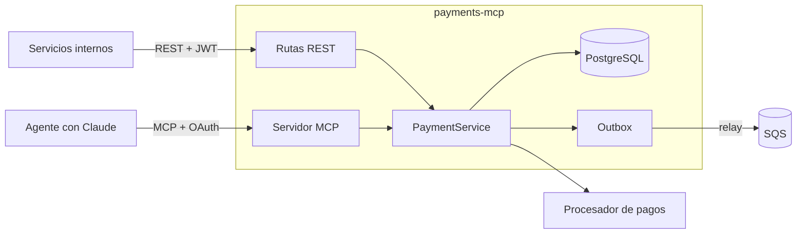

# payments-mcp

Middleware de pagos que expone **la misma lógica de negocio** a dos tipos de clientes:

- **Servicios internos**, por una API REST (`/api/v1/payments`) documentada con OpenAPI.
- **Agentes de IA**, por un servidor **MCP** (Model Context Protocol) en `/mcp`, con tools limitadas
  por permisos.

Lo construí con *Spec Driven Development*: el spec en [`.kiro/specs/payments/`](.kiro/specs/payments/)
(requisitos, diseño y tareas) va antes del código, y cada test referencia el requisito que cubre.



## Qué incluye

| Área | Qué hace | Dónde |
|---|---|---|
| **Pagos** | Cobros y reembolsos con máquina de estados; montos enteros en unidades menores | `src/features/payments/` |
| **Idempotencia** | `Idempotency-Key`: un reintento nunca cobra dos veces (REST y MCP comparten la misma) | `src/core/idempotency/` |
| **PostgreSQL** | SQL explícito, paginación por cursor (keyset), `SELECT … FOR UPDATE` contra reembolsos concurrentes | `db/migrations/` |
| **Auth** | OAuth2 *client credentials*, JWT ES256 + JWKS, scopes por ruta | `src/core/auth/`, `src/features/auth/` |
| **MCP** | Streamable HTTP sin estado, autorización según la spec MCP (Protected Resource Metadata), tools filtradas por scope, reembolso en dos pasos (vista previa → `confirm: true`) | `src/mcp/` |
| **Eventos** | Outbox transaccional + relay a SQS con `FOR UPDATE SKIP LOCKED`, entrega *at-least-once* | `src/core/events/` |
| **Observabilidad** | `/metrics` (RED por ruta, pagos por estado, tools MCP), logs JSON con `requestId`, Grafana + Prometheus + Loki | `src/core/metrics.ts`, `observability/` |
| **Agente demo** | Claude (Anthropic SDK) que descubre las tools por MCP, con aprobación humana para reembolsos | `src/agent/`, `scripts/agent-demo.ts` |
| **Infraestructura** | Terraform: SQS + DLQ, DynamoDB con TTL, VPC + EKS, rol IAM por Pod Identity | `infra/terraform/` |

## Cómo correrlo

Requisitos: Node.js ≥ 22.9 y Docker (para Postgres, LocalStack y el stack de observabilidad).

```bash
npm install
cp .env.example .env

npm run db:up        # Postgres en Docker
npm run dev          # API en http://localhost:3000 (Swagger en /docs)
```

[`api.http`](api.http) tiene ejemplos listos: pedir un token, crear un pago, reintentarlo con la misma
clave y reembolsarlo. Con el FakeProvider, un monto que termina en `13` se rechaza y uno que termina en
`99` hace timeout.

| Comando | Qué hace |
|---|---|
| `npm test` / `npm run test:cov` | Tests (`node:test`); la cobertura exige ≥ 85 % de líneas |
| `npm run sqs:up` / `npm run sqs:peek` | LocalStack con la cola de eventos / ver los mensajes publicados |
| `npm run obs:up` | App + Postgres + LocalStack + Prometheus + Loki + Alloy + Grafana (http://localhost:3001) |
| `npm run demo:agent` | Chat con un agente de Claude que usa el servidor MCP (necesita `ANTHROPIC_API_KEY`) |
| `npm run demo:mcp-wire` | Muestra los mensajes JSON-RPC crudos de MCP |
| `npm run demo:explain` | `EXPLAIN ANALYZE` antes y después del índice |
| `npm run tf:validate` | `terraform fmt -check` + `validate` (no toca AWS) |

### Credenciales de desarrollo

Están en [`client-registry.ts`](src/features/auth/client-registry.ts) y **solo sirven en local**:

| client_id | Secreto | Scopes |
|---|---|---|
| `tienda-a-backend` | `dev-secret-tienda-a` | read, write, refund |
| `tienda-a-agent` | `dev-secret-agent-a` | read, write (**no** puede reembolsar) |
| `tienda-b-backend` | `dev-secret-tienda-b` | read, write, refund (otro comercio) |
